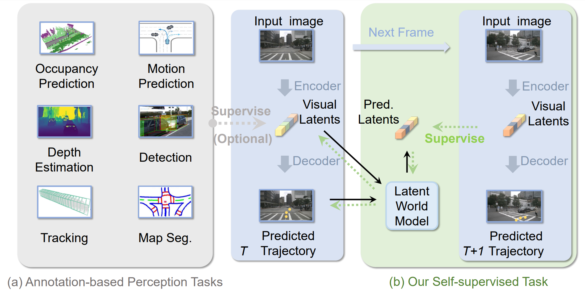

# Enhancing End-to-End Autonomous Driving with Latent World Model (ICLR 2025)
Yingyan Li, Lue Fan, Jiawei He, Yuqi Wang, Yuntao Chen, Zhaoxiang Zhang and Tieniu Tan

This [Paper](https://openreview.net/pdf?id=fd2u60ryG0)  presents the LAtent World model (LAW), a self-supervised framework that predicts future scene features from current features and ego trajectories. 



## 🔧 Installation

### 1. Create a Conda Virtual Environment and Activate It
```shell
conda create -n law python=3.8 -y
conda activate law
```

### 2. Install PyTorch and torchvision
```shell
pip install -r requirements.txt
pip install torch==1.9.1+cu111 torchvision==0.10.1+cu111 torchaudio==0.9.1 -f https://download.pytorch.org/whl/torch_stable.html
```

### 3. Install MMCV-Full
```shell
pip install mmcv-full==1.4.0
```

### 4. Install MMDetection and MMSegmentation
```shell
pip install mmdet==2.14.0
pip install mmsegmentation==0.14.1
pip install timm
```

### 5. Install MMDetection3D
```shell
conda activate law
git clone https://github.com/open-mmlab/mmdetection3d.git
cd /path/to/mmdetection3d
git checkout -f v0.17.1
python setup.py develop
```

### 6. Install NuScenes DevKit
```shell
pip install nuscenes-devkit==1.1.9
pip install yapf==0.40.1
```

### 7. Download NuScenes Dataset and Pickle Files
For the pickle files, download the [train](https://drive.google.com/file/d/1OVd6Rw2wYjT_ylihCixzF6_olrAQsctx/view?usp=sharing) and [val](https://drive.google.com/file/d/16DZeA-iepMCaeyi57XSXL3vYyhrOQI9S/view?usp=sharing) files from VAD.

Organize your dataset as follows:
```
LAW
├── projects/
├── data/nuscenes
│   ├── can_bus/
│   ├── nuscenes/
│   │   ├── maps/
│   │   ├── samples/
│   │   ├── sweeps/
│   │   ├── v1.0-test/
│   │   ├── v1.0-trainval/
│   │   ├── vad_nuscenes_infos_temporal_train.pkl
│   │   ├── vad_nuscenes_infos_temporal_val.pkl
```

## 🏋️‍♂️ Training
```shell
./tools/nusc_my_train.sh law/default 8
```

## 📊 Testing
```shell
./tools/dist_test $CONFIG $CKPT $NUM_GPU
```

## 📝 Results

| Method | L2 (m) 1s | L2 (m) 2s | L2 (m) 3s | L2 (m) Avg. | Collision (%) 1s | Collision (%) 2s | Collision (%) 3s | Collision (%) Avg. | Log and Checkpoints |
| --- | --- | --- | --- | --- | --- | --- | --- | --- | --- |
| LAW (Perception-Free) | 0.28 | 0.58 | 0.99 | 0.62 | 0.10 | 0.15 | 0.38 | 0.21 | [Google Drive](https://drive.google.com/drive/folders/1unZJNdmLM1YZXsCxOKkZsQoXzgemSYz0?usp=sharing) |

## 🚀 Citation
Please consider citing our work as follows if it is helpful.
```
@misc{li2024enhancing,
      title={Enhancing End-to-End Autonomous Driving with Latent World Model}, 
      author={Yingyan Li and Lue Fan and Jiawei He and Yuqi Wang and Yuntao Chen and Zhaoxiang Zhang and Tieniu Tan},
      year={2024},
      eprint={2406.08481},
      archivePrefix={arXiv},
      primaryClass={cs.CV}
}
```

## More from Us

If you're interested in **world models** for autonomous driving,  or looking for a world model codebase on NAVSIM,  feel free to check out our latest work:

- [**WoTE (ICCV 2025)**](https://github.com/liyingyanUCAS/WoTE): Using BEV world models for online trajectory evaluation in end-to-end autonomous driving.
