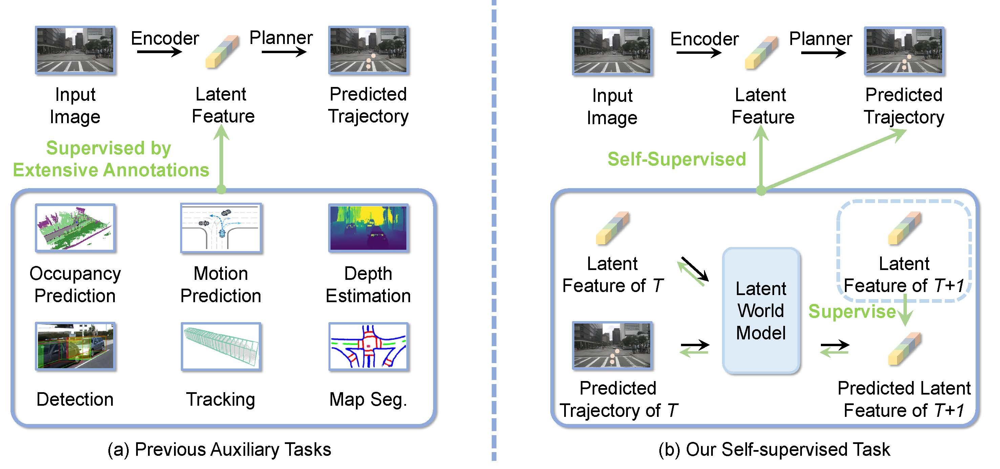
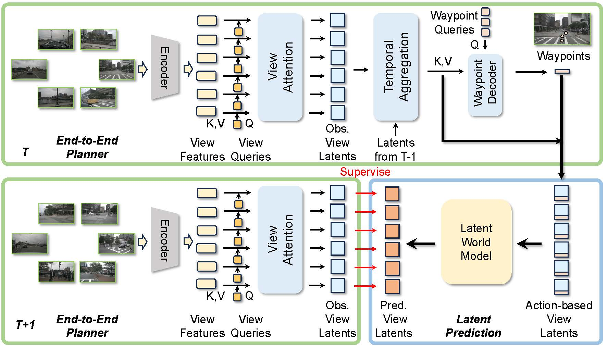

# Enhancing End-to-End Autonomous Driving with Latent World Model

## [](https://arxiv.org/abs/2406.08481)

## Introduction
We propose a LAtent World model (LAW) for self-supervised learning that enhances the training of
end-to-end autonomous driving.
<div align="center">
  
</div><br/>

## Pipeline
Initailly, we develop an end-to-end driving framework to extract
view latents and predict waypoints. Then, we predict the view latents of the next frame via the latent
world model. The predicted view latent is supervised by the observed view latent of the next frame.
<div align="center">
  
</div><br/>

## Citation
Please consider citing our work as follows if it is helpful.
```
@misc{li2024enhancing,
      title={Enhancing End-to-End Autonomous Driving with Latent World Model}, 
      author={Yingyan Li and Lue Fan and Jiawei He and Yuqi Wang and Yuntao Chen and Zhaoxiang Zhang and Tieniu Tan},
      year={2024},
      eprint={2406.08481},
      archivePrefix={arXiv},
      primaryClass={cs.CV}
}
```
